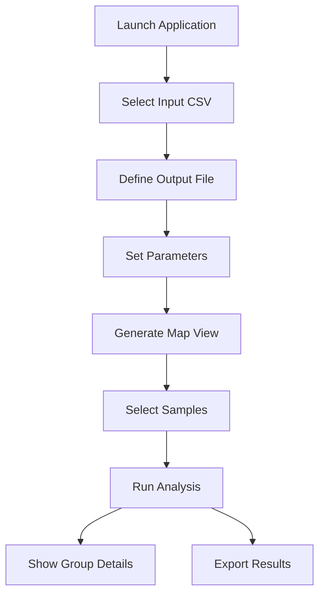
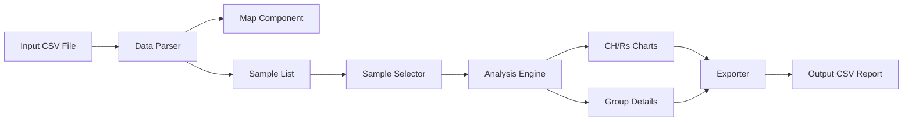
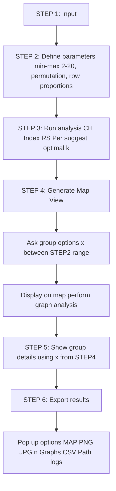

## Environment

```shell
# Install Brew
/bin/bash -c "$(curl -fsSL https://raw.githubusercontent.com/Homebrew/install/HEAD/install.sh)"
brew install --cask anaconda
conda init
conda create -n entro python=3.11
conda activate entro
pip install -r requirements.txt
python main.py
```

## Tests

### Group Details Module

```shell
# Make sure you are in the root directory
python frontend/test/test_group_details.py
```

## Data Usage Declaration

- Currently, the CH Index, RS Percentage, and Interactive Map Module utilize mock data from `frontend/sample_data.py`.
  - The mock data is formatted as a dictionary.
- The Group Details module employs actual data and includes a function `_parse_csv_data`, which can directly read `frontend/test/data/Input file GP for Entropy 20240910.csv` for testing purposes.
  - As indicated by `_on_show_group_details` in `main.py`, I assume the k value is 4. The `group_detail_popup.load_and_show_popups` function will read this k value and process the `grouped_samples`.

## Current Workflow Mermaid



### Component Architecture

```
Frontend
├── main.py (Main Application Window)
├── components/
│   ├── control_panel.py (Control Panel - Workflow Management)
│   ├── map_widget.py (Map Component - Sample Visualization)
│   ├── chart_widget.py (Chart Component - CH/Rs Analysis Charts)
│   ├── sample_list_widget.py (Sample List - Selection Management)
│   └── group_detail_popup.py (Group Detail Popup - Detailed Analysis)
├── utils/
│   └── csv_export.py (Results Export Utility)
└── sample_data.py (Test Data)
```

### Data Flow



## ToDo
### Change the logic workflow after confirmed from Piers

STEP 1: Input
STEP 2: Define analysis parameters: min & max(default 2 - 20), permutation, row proportions
STEP 3: Run analysis button(CH Index & RS Per and suggest a optimal k value)
STEP 4: Generate Map View -> Ask for group options x: ask the user to specify which groups they would like to view between the range of STEP2 and display on the map, as well as perform further graph analysis.
STEP 5: Show group deatils (Using the same options x defined from step 4 to show x graphs)
STEP 6: Export results -> Pop up options for users to select: (MAP PNG/JPG, n Graphs from range x, CSV Path, logs)

