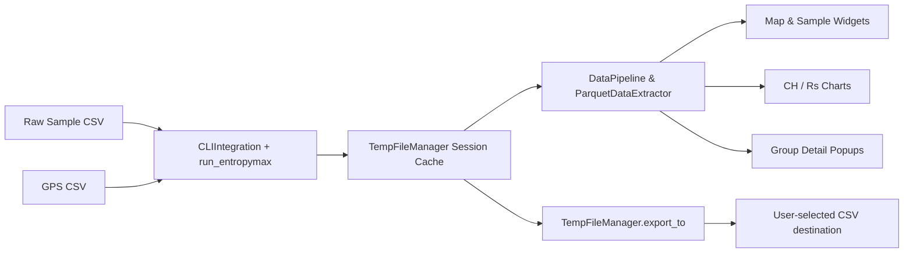

## Environment

```shell
# Install Brew
/bin/bash -c "$(curl -fsSL https://raw.githubusercontent.com/Homebrew/install/HEAD/install.sh)"
brew install --cask anaconda
conda init
conda create -n entro python=3.11
conda activate entro
pip install -r requirements.txt
python main.py
```

## Tests

### Group Details Module

```shell
# Make sure you are in the root directory
python frontend/test/test_group_details.py
```

## Data Usage Declaration

- The frontend always reads analysis results generated by the bundled `run_entropymax` CLI. Files are staged inside the session cache owned by `TempFileManager`, then parsed through `DataPipeline`/`ParquetDataExtractor`.

```

### Component Architecture

```
Frontend
├── main.py (Main application window & workflow orchestrator)
├── components/
│   ├── control_panel.py (Input selection & workflow controls)
│   ├── interactive_map_widget.py (Folium-powered map view)
│   ├── sample_list_widget.py (Sample selection list)
│   ├── chart_widget.py (CH / Rs charts with selection callbacks)
│   ├── group_detail_popup.py (Detailed group analysis popups)
│   └── module_preview_card.py (Dashboard preview cards & launchers)
├── utils/
│   ├── cache_paths.py (Per-platform cache discovery & migration)
│   ├── temp_manager.py (Session cache & bundled binary staging)
│   ├── cli_integration.py (Wrapper around `run_entropymax` CLI)
│   ├── data_pipeline.py (CSV→Parquet conversion & summary extraction)
│   ├── parquet_extractor.py (Group/GPS structure utilities)
│   └── csv_validator.py (Raw/GPS CSV validation helpers)
└── help/
  └── format_examples_dialog.py (CSV formatting helper dialog)
```

### Data Flow

