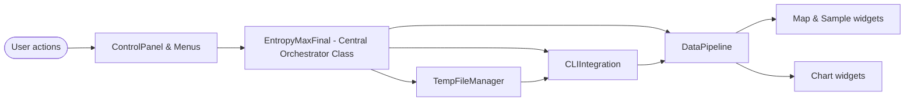
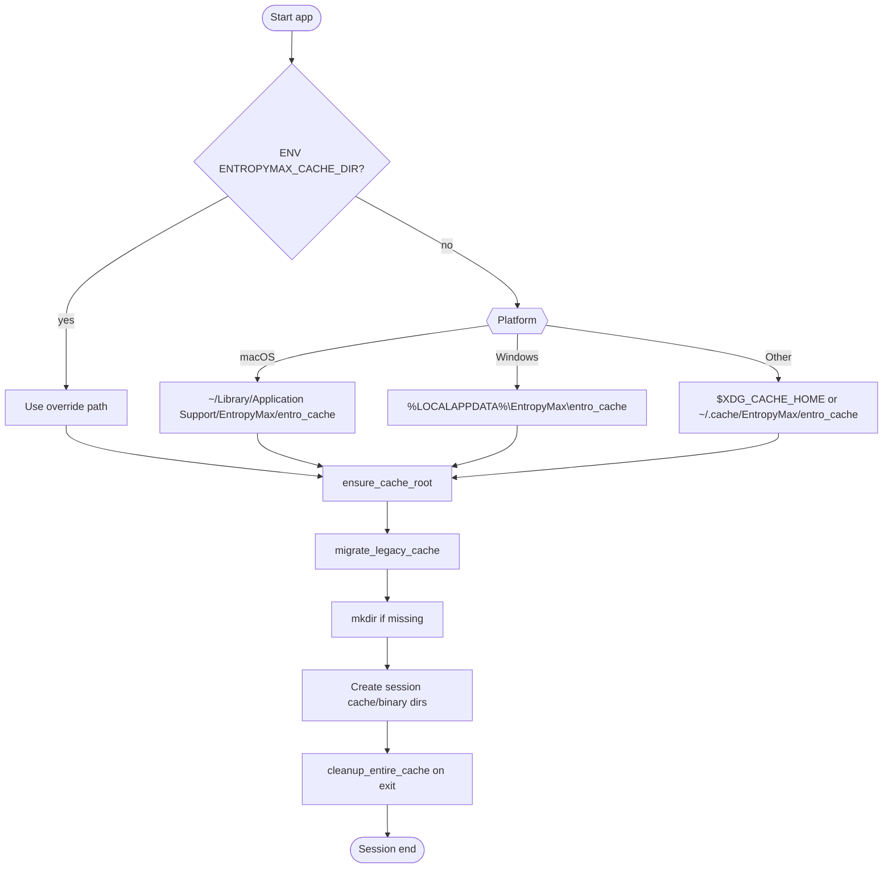

# Architecture Design

## Big picture

## Layers
- **Presentation**: `EntropyMaxFinal` window + module preview cards, map (`InteractiveMapWidget` + `SampleListWidget`), charts (`ChartWidget`), dialogs (settings, help).
- **Orchestration**: signal wiring, workflow state, exports handled inside `EntropyMaxFinal` and `StandaloneWindow` wrappers.
- **Data/IO**: `TempFileManager` (cache root + session folders), `CLIIntegration` (executes bundled binary), `DataPipeline` (conversion + summarizing), `ParquetDataExtractor` (group/GPS structure), `TempFileManager.export_to` (CSV export flow).

## Runtime flow
1. User selects CSV + GPS via `ControlPanel`.
2. `EntropyMaxFinal._on_run_analysis`
	 - prepares cache using `TempFileManager.ensure_cache_root()`
	 - copies CLI binary into cache/binary
	 - launches `run_entropymax` through `CLIIntegration`.
3. CLI writes parquet + CSV into cache/session.
4. `DataPipeline.extract_analysis_data`
	 - loads parquet with `ParquetDataExtractor` logic
	 - returns metrics, grouping, GPS maps, optimal K.
5. UI updates: charts plot CH/Rs, map renders markers, list syncs selection; group detail popup uses `_on_show_group_details` with pipeline.
6. On exit, `TempFileManager.cleanup_entire_cache()` trims `cache/` while keeping `binary/` for next run.

## Parquet extractor refactor
- Original Jeremy's file `get_grouping_data` used position-based column access. We wrapped it as `ParquetDataExtractor` to add:
	- logging + validation,
	- reusable helper methods (`get_data_for_k`, `get_group_ids_for_k`, `get_gps_data_for_k`).
- **Functions reused unchanged in spirit**:
	- the core `_add_group_data` structure mirrors their `add_group_data` (same keys: `group`, `x`, `sample_id`, `latitude`, `longitude`).
	- legacy access pattern preserved via `create_data(input_file)` so any existing imports still work.
- Why refactor: made it safe for production (error handling, caching positions, validation) while keeping their data model so downstream charts/maps read identical structures.

## Cache manager workflow
